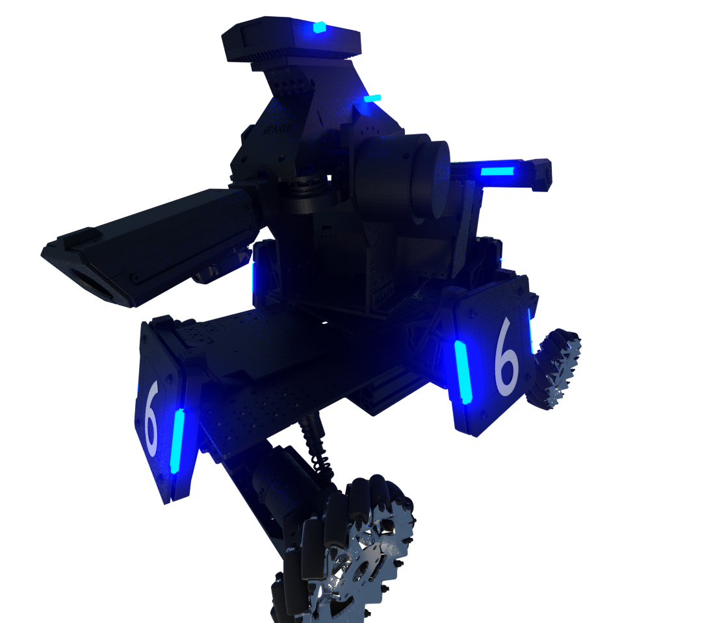
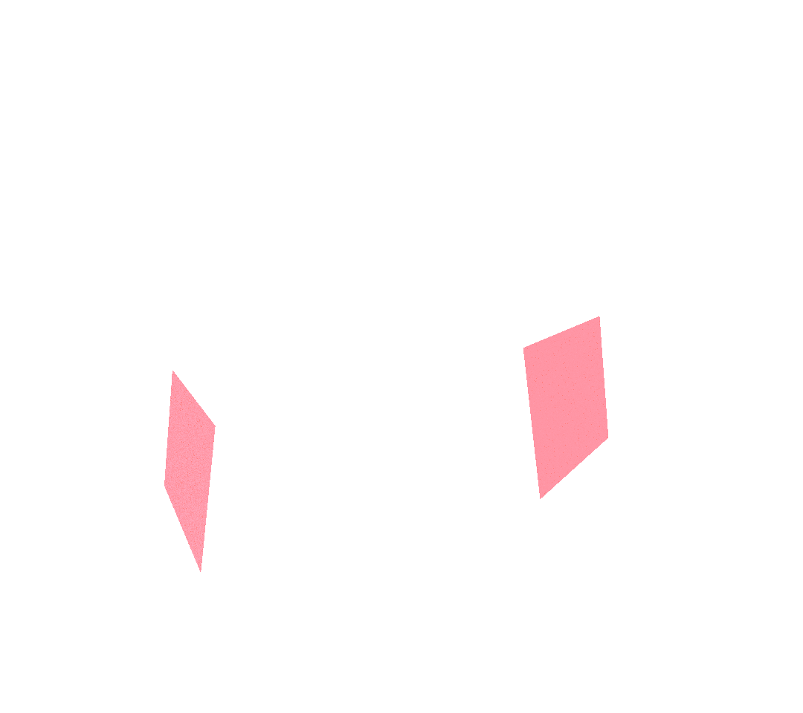
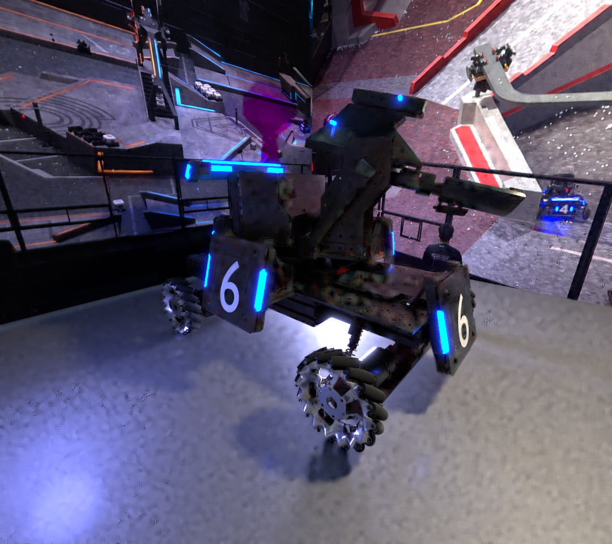
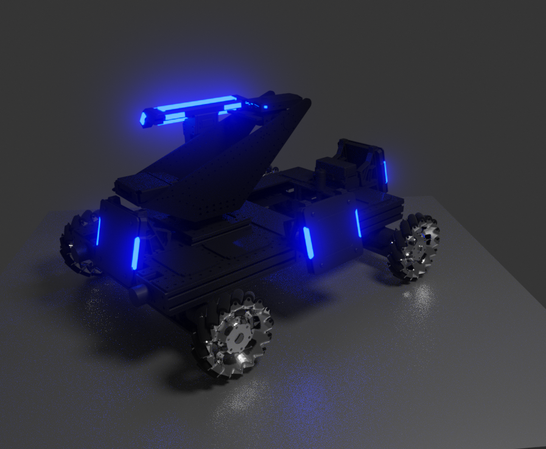

# Proof of Concept Synthetic Dataset Generator 

### Setup
1. Get [Blender](https://www.blender.org/download/), only version 2.90.1 is tested. 
1. Download [model file](https://uillinoisedu-my.sharepoint.com/personal/yixiaos3_illinois_edu/_layouts/15/onedrive.aspx?originalPath=aHR0cHM6Ly91aWxsaW5vaXNlZHUtbXkuc2hhcmVwb2ludC5jb20vOmY6L2cvcGVyc29uYWwveWl4aWFvczNfaWxsaW5vaXNfZWR1L0VrUWVuVVhWaWVsTWt1a2p1M1dGcjVjQm1veHBGRFFlQUZZek1fZUpFSExBVXc_cnRpbWU9WnQ4TmY2WkgyRWc&id=%2Fpersonal%2Fyixiaos3_illinois_edu%2FDocuments%2FRM 2021%2FAI Vision%2FDataset%2FSynthesis%2FBatch_Render_Infantry)
1. Open model file with blender, and import `scene_setup_transparent.py` in the script tab.
1. Change parameters in the script as needed (see `CHANGE ME` section), and run it. 
1. Go to render tab and select rendering engine, quality and other parameters as needed. 
1. Render animation frames as normal. Labels and images require two separate renders using the same seed. 

### Know Issues
1. Robot texture does not match real robot, and lacks randomization.
1. Robot health bar currently remains constant. 
1. Robot number text font is inaccurate. 
1. Importing image texture permanently increases project file size. 
1. Background texture need to be manually imported.

### Demo
#### Foreground Only (Output and Label)

#### With Background (Background Manually Set up)

#### Model Used 

